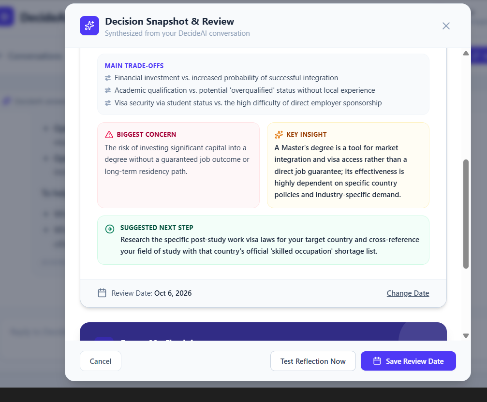
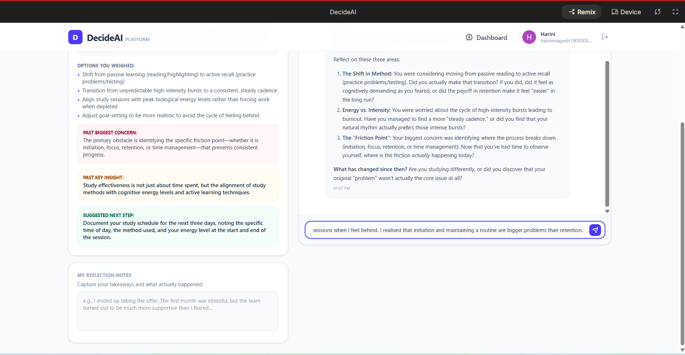

# 🧠 DecideAI — AI-Powered Decision Intelligence Platform

## Project Overview

DecideAI is an AI-powered decision intelligence and reflection platform designed to help users think through important decisions, preserve their original reasoning, and revisit those decisions later with the benefit of real-world experience.

The platform uses Google Gemini for multi-turn AI conversations, Firebase Authentication for secure user access, Cloud Firestore for isolated data storage, Google Cloud Secret Manager for secure secret management, and Google Cloud Run for cloud-native deployment.

Unlike a traditional AI journal that only records what a user says, DecideAI helps users:

- Explore complex decisions
- Compare multiple options
- Identify trade-offs
- Generate structured Decision Snapshots
- Preserve their original assumptions
- Schedule future check-ins
- Reflect on what changed over time
- Receive context-aware AI insights

---

# 🌟 Original Feature Enhancement

## Future Me Check-in & Context-Aware Reflection

The primary original enhancement developed for DecideAI is the **Future Me Check-in system**.

A traditional AI journal captures a user's thoughts at one point in time.

DecideAI creates a bridge between the user's past assumptions and their future reality.

```text
┌─────────────────────────┐
│       PAST YOU          │
│ Original Conversation   │
└────────────┬────────────┘
             │
             ▼
┌─────────────────────────┐
│    Decision Snapshot    │
│ Original Thoughts and   │
│ Assumptions Preserved   │
└────────────┬────────────┘
             │
             ▼
┌─────────────────────────┐
│ Future Check-in Planned │
└────────────┬────────────┘
             │
             │ Time Passes
             ▼
┌─────────────────────────┐
│     PRESENT YOU         │
│ Real-World Experience   │
└────────────┬────────────┘
             │
             ▼
┌─────────────────────────┐
│   User Reflection       │
│ "What actually changed?"│
└────────────┬────────────┘
             │
             ▼
┌─────────────────────────┐
│ Gemini Context Analysis │
│ Past + Present Context  │
└────────────┬────────────┘
             │
             ▼
┌─────────────────────────┐
│   FUTURE INSIGHT        │
│ Improved Understanding  │
│ and Decision-Making     │
└─────────────────────────┘
```

---

# 🏗️ System Architecture

DecideAI uses a secure cloud-native architecture built with Google Cloud, Firebase, and Gemini.

```text
                         ┌───────────────────┐
                         │     DecideAI      │
                         │      Web App      │
                         └─────────┬─────────┘
                                   │
                                   ▼
                     ┌─────────────────────────┐
                     │ Firebase Authentication │
                     │  User Identity & Access │
                     └────────────┬────────────┘
                                  │
                                  ▼
                     ┌─────────────────────────┐
                     │   Application Backend   │
                     │   Google Cloud Run      │
                     └────────────┬────────────┘
                                  │
                 ┌────────────────┼────────────────┐
                 │                │                │
                 ▼                ▼                ▼
       ┌─────────────────┐ ┌────────────────┐ ┌─────────────────┐
       │ Google Secret   │ │   Gemini API   │ │ Cloud Firestore │
       │    Manager      │ │   AI Engine    │ │ User Data Store │
       └─────────────────┘ └───────┬────────┘ └────────┬────────┘
                                   │                   │
                                   ▼                   │
                         ┌──────────────────┐          │
                         │ Multi-Turn AI    │          │
                         │ Conversation     │          │
                         └────────┬─────────┘          │
                                  │                    │
                   ┌──────────────┼──────────────┐     │
                   │              │              │     │
                   ▼              ▼              ▼     ▼
          ┌──────────────┐ ┌──────────────┐ ┌─────────────────┐
          │   Decision   │ │  Future Me   │ │ User-Isolated   │
          │   Snapshots  │ │   Check-In   │ │ Conversations   │
          └──────────────┘ └──────────────┘ └─────────────────┘
```

---

# 🔄 Application Workflow

## Step 1 — User Authentication

The user signs in securely through Firebase Authentication.

```text
┌──────────────┐
│     User     │
└──────┬───────┘
       │
       ▼
┌─────────────────────────┐
│ Firebase Authentication │
└────────────┬────────────┘
             │
             ▼
┌─────────────────────────┐
│ Authenticated Session   │
│ User Identity Verified  │
└─────────────────────────┘
```

Once authenticated, the user's identity is used to control access to their private conversations, Decision Snapshots, and Future Me Check-ins.

---

## Step 2 — Multi-Turn AI Conversation

The user starts a conversation with DecideAI and discusses a decision or problem.

### Example

> "Should I pursue a Master's degree abroad or try to get a job directly?"

Gemini helps the user explore:

- Possible options
- Advantages
- Disadvantages
- Financial considerations
- Career implications
- Immigration considerations
- Personal priorities

### Conversation Flow

```text
┌──────────────────┐
│   User Question  │
└────────┬─────────┘
         │
         ▼
┌────────────────────────┐
│    DecideAI Platform   │
└────────┬───────────────┘
         │
         ▼
┌────────────────────────┐
│     Gemini AI Engine   │
└────────┬───────────────┘
         │
         ▼
┌────────────────────────┐
│ AI Response + Context  │
└────────┬───────────────┘
         │
         ▼
┌────────────────────────┐
│    User Follow-Up      │
└────────┬───────────────┘
         │
         └───────────────► Multi-Turn Conversation
```

The conversation maintains context to support deeper decision analysis.

---

## Step 3 — Decision Snapshot Generation

The conversation can be transformed into a structured **Decision Snapshot**.

```text
┌────────────────────────────┐
│ Original AI Conversation   │
└─────────────┬──────────────┘
              │
              ▼
┌────────────────────────────┐
│    What You Were Thinking  │
└─────────────┬──────────────┘
              │
              ▼
┌────────────────────────────┐
│    Options Considered      │
└─────────────┬──────────────┘
              │
              ▼
┌────────────────────────────┐
│ Key Factors & Priorities   │
└─────────────┬──────────────┘
              │
              ▼
┌────────────────────────────┐
│      Main Trade-Offs       │
└─────────────┬──────────────┘
              │
              ▼
┌────────────────────────────┐
│      Biggest Concern       │
└─────────────┬──────────────┘
              │
              ▼
┌────────────────────────────┐
│        Key Insight         │
└─────────────┬──────────────┘
              │
              ▼
┌────────────────────────────┐
│     Suggested Next Step    │
└─────────────┬──────────────┘
              │
              ▼
┌────────────────────────────┐
│ Secure Firestore Storage   │
└────────────────────────────┘
```

Each snapshot preserves the user's original decision context for future reflection.

---

## Step 4 — Future Me Check-in Scheduling

The user selects when they want to revisit a previous decision.

```text
┌──────────────────────┐
│   Decision Snapshot  │
└──────────┬───────────┘
           │
           ▼
┌──────────────────────┐
│ Select Review Date   │
└──────────┬───────────┘
           │
           ▼
┌──────────────────────┐
│ Save Future Check-In │
└──────────┬───────────┘
           │
           ▼
┌──────────────────────┐
│ Store in Firestore   │
└──────────┬───────────┘
           │
           │
           │ Time Passes
           ▼
┌──────────────────────┐
│ Review Date Arrives  │
└──────────────────────┘
```

Available scheduling options include:

- 1 Week
- 1 Month
- 3 Months
- 6 Months
- Custom Date

---

## Step 5 — Future Reflection

When the user revisits the decision, DecideAI retrieves the original context.

Gemini asks a reflection question based on the user's earlier Decision Snapshot.

### Example

> "A previous version of you wanted to revisit this decision. What has changed since then?"

```text
┌───────────────────────────┐
│ Future Check-In Opens     │
└────────────┬──────────────┘
             │
             ▼
┌───────────────────────────┐
│ Retrieve Original         │
│ Decision Snapshot        │
└────────────┬──────────────┘
             │
             ▼
┌───────────────────────────┐
│ Gemini Reviews Original   │
│ Context and Assumptions   │
└────────────┬──────────────┘
             │
             ▼
┌───────────────────────────┐
│ Reflection Question       │
└────────────┬──────────────┘
             │
             ▼
┌───────────────────────────┐
│ User Describes What       │
│ Actually Happened         │
└───────────────────────────┘
```

---

## Step 6 — AI-Assisted Re-evaluation

Gemini compares the user's past and present perspectives.

```text
┌────────────────────────┐
│   Original Decision    │
└────────────┬───────────┘
             │
┌────────────▼───────────┐
│ Original Assumptions   │
└────────────┬───────────┘
             │
             │
┌────────────▼───────────┐
│ New Real-World         │
│ Experience             │
└────────────┬───────────┘
             │
             │
┌────────────▼───────────┐
│ Current User Reflection│
└────────────┬───────────┘
             │
             ▼
┌────────────────────────┐
│ Gemini Context Analysis│
└────────────┬───────────┘
             │
             ▼
┌────────────────────────┐
│ New Context-Aware      │
│ Insight                │
└────────────────────────┘
```

This process helps users understand how their thinking and circumstances evolved over time.

---

# 📁 User-Isolated Firestore Storage

All user conversations and Decision Snapshots are stored using Firebase Cloud Firestore.

The data structure is designed to maintain user-level isolation.

## Firestore Architecture

```text
Firestore
│
└── users
    │
    ├── {userId_1}
    │   │
    │   ├── conversations
    │   │   │
    │   │   └── {conversationId}
    │   │
    │   ├── snapshots
    │   │   │
    │   │   └── {snapshotId}
    │   │
    │   └── future_checkins
    │       │
    │       └── {checkInId}
    │
    └── {userId_2}
        │
        ├── conversations
        │   └── {conversationId}
        │
        ├── snapshots
        │   └── {snapshotId}
        │
        └── future_checkins
            └── {checkInId}
```

Each authenticated user can access only their own documents.

---

# 🔥 Firestore Security

Firestore security rules are configured to prevent cross-user data access.

```text
┌──────────────────────┐
│ Authenticated User A │
└──────────┬───────────┘
           │
           ▼
┌──────────────────────┐
│ Can Access Only      │
│ User A Data          │
└──────────────────────┘


┌──────────────────────┐
│ Authenticated User B │
└──────────┬───────────┘
           │
           ▼
┌──────────────────────┐
│ Can Access Only      │
│ User B Data          │
└──────────────────────┘
```

This prevents unauthorized users from accessing another user's:

- Conversations
- Decision Snapshots
- Reflection Notes
- Future Check-ins

The complete Firestore security rules are included in:

```text
firestore.rules
```

---

# 🛠️ Technology Stack

| Layer | Technology |
|---|---|
| Frontend | React / TypeScript |
| Backend | Node.js |
| AI | Google Gemini API |
| Authentication | Firebase Authentication |
| Database | Cloud Firestore |
| Secret Management | Google Cloud Secret Manager |
| Deployment | Google Cloud Run |
| Hosting Architecture | Google Cloud |
| Version Control | Git & GitHub |
| Development Environment | Google AI Studio |

---

# 📁 Project Structure

```text
DecideAI/
│
├── public/
│   └── assets/
│
├── src/
│   │
│   ├── components/
│   │   ├── ChatView.tsx
│   │   ├── DecisionSnapshot.tsx
│   │   ├── FutureCheckIn.tsx
│   │   └── Dashboard.tsx
│   │
│   ├── services/
│   │   ├── firebase.ts
│   │   ├── gemini.ts
│   │   └── snapshotService.ts
│   │
│   ├── lib/
│   │   └── firebase.ts
│   │
│   ├── App.tsx
│   └── main.tsx
│
├── server.ts
│
├── firestore.rules
│
├── firebase-applet-config.json
│
├── .env.example
│
├── package.json
│
├── tsconfig.json
│
├── bun.lock
│
└── README.md
```

---

# 🔐 Secure Secret Management

Sensitive API keys and production secrets should never be hardcoded in the application source code.

```text
┌───────────────┐
│   Developer   │
└───────┬───────┘
        │
        ▼
┌─────────────────────┐
│ Google Cloud Secret │
│      Manager        │
└──────────┬──────────┘
           │
           ▼
┌─────────────────────┐
│ Cloud Run Service   │
└──────────┬──────────┘
           │
           ▼
┌─────────────────────┐
│ Secure Application  │
│ Configuration       │
└─────────────────────┘
```

This prevents sensitive information from being exposed in:

- Source code
- Public GitHub repositories
- Frontend application bundles
- Version control history

---

# ⚙️ Local Setup

## 1. Clone the Repository

```bash
git clone <your-repository-url>
cd DecideAI
```

---

## 2. Install Dependencies

```bash
npm install
```

Or, if using Bun:

```bash
bun install
```

---

## 3. Configure Environment Variables

Create a `.env` file based on `.env.example`.

```bash
cp .env.example .env
```

Example configuration:

```env
GEMINI_API_KEY=your_gemini_api_key
FIREBASE_PROJECT_ID=your_firebase_project_id
```

Never commit actual API keys or sensitive environment variables to GitHub.

---

## 4. Configure Firebase

Create or configure a Firebase project with:

- Firebase Authentication
- Cloud Firestore

Update the Firebase configuration for your local environment.

---

## 5. Configure Firestore Rules

Deploy the Firestore security rules:

```bash
firebase deploy --only firestore:rules
```

Verify that users cannot access documents belonging to another authenticated user.

---

## 6. Start the Application

```bash
npm run dev
```

Or:

```bash
bun run dev
```

The application should now be available locally.

---

# ☁️ Google Cloud Run Deployment

## Step 1 — Authenticate with Google Cloud

```bash
gcloud auth login
```

## Step 2 — Select Your Project

```bash
gcloud config set project YOUR_PROJECT_ID
```

## Step 3 — Build and Deploy

```bash
gcloud run deploy decideai \
  --source . \
  --region YOUR_REGION \
  --allow-unauthenticated
```

---

# 🏷️ Cloud Run Challenge Label

For the challenge, the deployed Cloud Run service must include the required label:

```text
dev-tutorial=cloud-run-ai-challenge
```

Verify the service configuration after deployment.

---

# 📊 Key Application Features

## Decision Intelligence

- Multi-turn AI conversations
- Option comparison
- Trade-off analysis
- Priority identification
- Structured decision summaries

## Decision Snapshots

Stores:

- Original thinking
- Options considered
- Key factors
- Trade-offs
- Biggest concern
- Key insight
- Suggested next step

## Future Me Check-ins

Allows users to:

- Schedule future reviews
- Select review intervals
- Add custom review dates
- Revisit previous decisions
- Reflect on actual outcomes
- Receive context-aware AI analysis

---

# 🧪 Testing

The following functionality was tested:

- Firebase Authentication
- User conversation creation
- Multi-turn Gemini responses
- Decision Snapshot generation
- Firestore data storage
- User-level data isolation
- Future Check-in scheduling
- Custom review date selection
- Future reflection conversations
- Context-aware Gemini responses
- Check-in completion workflow

---

# 🔐 Security Considerations

The application follows production-oriented security practices.

## API Key Protection

- No production API keys are hardcoded
- Sensitive configuration is excluded from Git
- Secrets are managed securely

## Authentication

- Users must authenticate before accessing private data
- Firebase Authentication manages user identity

## Firestore Isolation

- User data is protected through Firestore security rules
- Cross-user access is restricted

## Production Deployment

- Application is designed for Google Cloud infrastructure
- Secrets are separated from application source code

---

# 🎯 Learning Outcomes

This project demonstrates practical understanding of:

- Generative AI application development
- Gemini API integration
- Multi-turn conversational systems
- Firebase Authentication
- Firestore data modeling
- Database security rules
- User data isolation
- Secret management
- Cloud-native deployment
- Google Cloud Run
- Context-aware AI workflows
- Production-oriented AI application design

---

# 🔮 Future Improvements

## Notifications

Future versions could include:

- Email reminders
- Push notifications
- Calendar integration

## Decision Timeline

Users could visualize their decisions over time:

```text
┌─────────────────┐
│  Past Decision  │
└────────┬────────┘
         │
         ▼
┌─────────────────┐
│   Reflection    │
└────────┬────────┘
         │
         ▼
┌─────────────────┐
│     Outcome     │
└────────┬────────┘
         │
         ▼
┌─────────────────┐
│  Lesson Learned │
└─────────────────┘
```

## Decision Analytics

Potential analytics could include:

- Most common decision categories
- Changes in user priorities
- Decision confidence over time
- Reflection patterns

## Advanced AI Insights

Future AI capabilities could include:

- Decision pattern analysis
- Contradiction detection
- Assumption tracking
- Long-term personal insight summaries

---

# 📸 Screenshots

## DecideAI Conversation


## Decision Snapshot



## Future Me Check-in


## Context-Aware Future Reflection



## AI-Assisted Re-evaluation


---

# 👩‍💻 Author

**Harini M**

AI-Powered Decision Intelligence Project

Built for the **Ideathon Challenge: Build a Secure Personal Gemini Journal**
